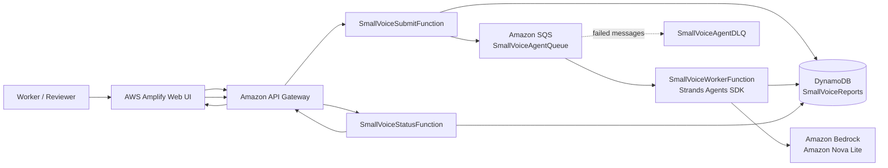

# Small Voice Agent

**Turn small workplace concerns into visible, reviewable improvement proposals — while keeping the final decision with people.**

[Live Demo](https://main.dsof2wtaq9pwf.amplifyapp.com/)

Small Voice Agent is a human-centered AWS application for the kinds of workplace friction that are often too small to become a formal report: an awkward reach repeated all day, different ways of teaching the same task, or a temporary workaround that keeps the job moving but is rarely recorded.

The system accepts a short concern in ordinary language, processes it asynchronously with a **Strands Agents SDK** Agent backed by Amazon Bedrock / Amazon Nova Lite, stores the result and processing evidence in DynamoDB, and returns a clear completion state to the user. The output is explicitly presented for **human review**, not as an autonomous workplace decision.

---

## Why I built it

People closest to the work often notice problems first.

But not every useful observation looks like a major incident. Many are small:

- one extra reach repeated many times,
- a handoff that depends on memory,
- two experienced workers teaching the same task differently,
- a temporary workaround that becomes normal during a busy period,
- a small inconvenience that is tolerated because the work still gets done.

These observations can disappear before they become improvement knowledge.

Small Voice Agent is designed to make that first small voice easier to capture, structure, and review.

---

## What it does

1. A worker or reviewer enters a **small voice or concern** and optional context.
2. The frontend sends the report through **Amazon API Gateway**.
3. `SmallVoiceSubmitFunction` validates the input, creates a report record, and sends a message to **Amazon SQS**.
4. SQS invokes `SmallVoiceWorkerFunction` asynchronously.
5. The worker creates a **Strands Agents SDK** `Agent` with `BedrockModel` and invokes **Amazon Bedrock / Amazon Nova Lite** to structure the concern into a practical proposal.
6. The result, model identifier, timestamps, and processing state are stored in **Amazon DynamoDB**.
7. The web UI polls `SmallVoiceStatusFunction` until the durable record reaches `DONE` or `FAILED`.
8. The result is shown with **Human review required** so the final judgment stays with a person.

---

## Live AWS architecture



### Main AWS services

| Service | Role |
|---|---|
| AWS Amplify Hosting | Hosts the public web interface |
| Amazon API Gateway | Exposes submit and status endpoints |
| AWS Lambda | Submit, worker, and status processing |
| Amazon SQS | Asynchronous work queue |
| Amazon Bedrock | Foundation-model processing |
| Amazon Nova Lite | Model used by the verified live run |
| Strands Agents SDK | Agent framework used inside the Worker Lambda |
| Amazon DynamoDB | Durable report, result, and status storage |
| Amazon CloudWatch | Runtime logs and processing evidence |

---

## Why this is more than a chatbot

Small Voice Agent does not simply return text from one synchronous prompt.

It performs a stateful task across AWS services:

`QUEUED → PROCESSING → DONE / FAILED`

The system:

- accepts work,
- creates a durable report ID,
- queues the task,
- invokes a foundation model,
- stores the generated result,
- records the model used,
- verifies terminal processing state,
- and hands the result back to a human reviewer.

The UI does **not** treat “submitted” as “complete.” A report becomes complete only when the durable DynamoDB state confirms `processing_status = DONE`.

---

## Completion signal

The web interface uses explicit status states so completion is understandable at a glance.

| State | UI meaning |
|---|---|
| `PROCESSING` | Accepted or running; not complete yet |
| `DONE` | Processing is complete and the result is stored |
| `FAILED` | Completion could not be confirmed |

A successful result shows:

- `DONE`
- `Processing complete`
- the report ID
- the model used
- the generated Agent result
- `Human review required`

Color is reinforced with icons and text, so status is not communicated by color alone.

---

## Verified live status — September 5, 2026

The public AWS deployment was verified end to end.

### Verified pipeline

`Amplify → API Gateway → Submit Lambda → SQS → Worker Lambda → Bedrock / Nova Lite → DynamoDB → Status Lambda → Web UI`

### Verified evidence

- Public Amplify UI loads successfully.
- `POST /reports` creates a report and returns a report ID.
- `GET /reports/{report_id}` returns the durable processing state.
- `SmallVoiceWorkerFunction` processes queued work.
- `agent_result_text` is stored in DynamoDB.
- `bedrock_model` is stored as `amazon.nova-lite-v1:0`.
- `processing_status` reaches `DONE`.
- `worker_finished_at` is recorded.
- Main SQS queue visible messages: **0** after processing.
- DLQ visible messages: **0** after processing.
- The UI reaches `DONE / Processing complete` and shows the Agent result.

### Three live scenarios verified

1. **Different senior workers teach the same task differently**  
   The Agent organized the uncertainty without assuming one method was automatically correct.

2. **Repeated reach across a workbench causing shoulder fatigue**  
   The Agent connected the small physical burden to layout and repeated motion, then proposed a proportionate first step.

3. **Temporary use of another shelf when the normal storage area is full**  
   The Agent captured a workaround that still allows the job to finish normally — exactly the kind of small adaptation that can otherwise remain invisible.

All three scenarios completed successfully in the live application.

---

## Human review boundary

Small Voice Agent is intentionally conservative.

It does **not**:

- automatically change workplace rules,
- rewrite SOPs,
- rank workers,
- score productivity,
- determine disciplinary action,
- make medical or safety diagnoses,
- or treat an AI proposal as the final answer.

The Agent structures a small concern and proposes a next step. A person decides what happens next.

---

## Example input

**Small voice or concern**

> When the usual storage area is full, I temporarily place completed items on another shelf and move them back later. The work still finishes normally, so this is rarely reported.

**Context**

> Manufacturing workplace. This happens mainly during the busy afternoon period.

The useful point is not to label the workaround as automatically right or wrong. The Agent helps make the situation visible so a human can review the conditions, repetition, and possible improvement.

---

## Repository structure

```text
frontend/
  index.html
  app.js
  styles.css
  config.js

lambda/
  worker_strands/
    lambda_function.py
    requirements.txt
    README_STRANDS_UPDATE.md
    ARCHITECTURE_STRANDS_UPDATE.md
    AWS_DEPLOY_STEPS.md
    TEST_CASES.md
  submit_api/
    handler.py
  status_api/
    handler.py

tests/
  test_handlers.py

docs/
  AWS_CONSOLE_STEPS.md
  FINAL_AUDIT.md

submission/
  DEVPOST_ENTRY.md
  VIDEO_SCRIPT.md
  DEMO_SCENARIOS.md
  SUBMISSION_CHECKLIST.md
```

The Strands-compatible `SmallVoiceWorkerFunction` source is published in `lambda/worker_strands/lambda_function.py`. It preserves the existing SQS, DynamoDB, status, and Web UI contracts while replacing the direct Bedrock call with an actual Strands `Agent` invocation.

---

## API contract

### Submit a report

`POST /reports`

```json
{
  "voice_text": "A small workplace concern",
  "context": "Optional workplace context"
}
```

Typical accepted response:

```json
{
  "tenant_id": "small-voice-v01",
  "report_id": "<uuid>",
  "entity_key": "REPORT#<uuid>",
  "processing_status": "QUEUED"
}
```

### Check report status

`GET /reports/{report_id}`

When processing is complete, the response can include:

```json
{
  "report_id": "<uuid>",
  "processing_status": "DONE",
  "agent_result_text": "...",
  "bedrock_model": "amazon.nova-lite-v1:0"
}
```

---

## Local verification

Run the dependency-free handler tests:

```bash
python3 -m unittest discover -s tests -v
```

Current package result:

```text
Ran 3 tests
OK
```

Serve the frontend locally:

```bash
python3 -m http.server 8080 -d frontend
```

Set the deployed API Gateway base URL in `frontend/config.js` before testing the local UI.

**Never place AWS credentials or secrets in frontend code.**

---

## Privacy and responsible use

For demonstrations, use synthetic or consented workplace examples only.

Do not submit:

- personal names unless necessary and authorized,
- confidential company information,
- medical details,
- accusations about individuals,
- credentials, secrets, or private identifiers.

The system is designed to support review and small-scale improvement, not employee surveillance.

---

## What I learned

I am a non-engineer, so one of the biggest lessons from building this project was that a useful AI result is only one part of a dependable system.

A real workflow also needs:

- a clear intake,
- queue state,
- durable records,
- failure paths,
- visible completion,
- traceability,
- and a clear handoff back to people.

For me, the most important design decision was simple: **AI can help organize a small voice, but it should not take the final judgment away from the people doing the work.**

---

## What's next

Possible next steps include:

- reviewer feedback on proposals,
- grouping repeated concerns while preserving local context,
- comparing recurring patterns across time,
- measuring whether small proposals lead to safe, reversible improvements,
- and improving multilingual support for frontline teams.

The goal is to keep the system close to real work rather than turning it into another top-down evaluation tool.

---

## Creator

Built by **Takashi S.**  
Creator of **GENBA DAIICHI AI**  
Odawara, Japan

**GENBA DAIICHI AI — turning small workplace friction into the next practical improvement.**

---

## License

MIT
