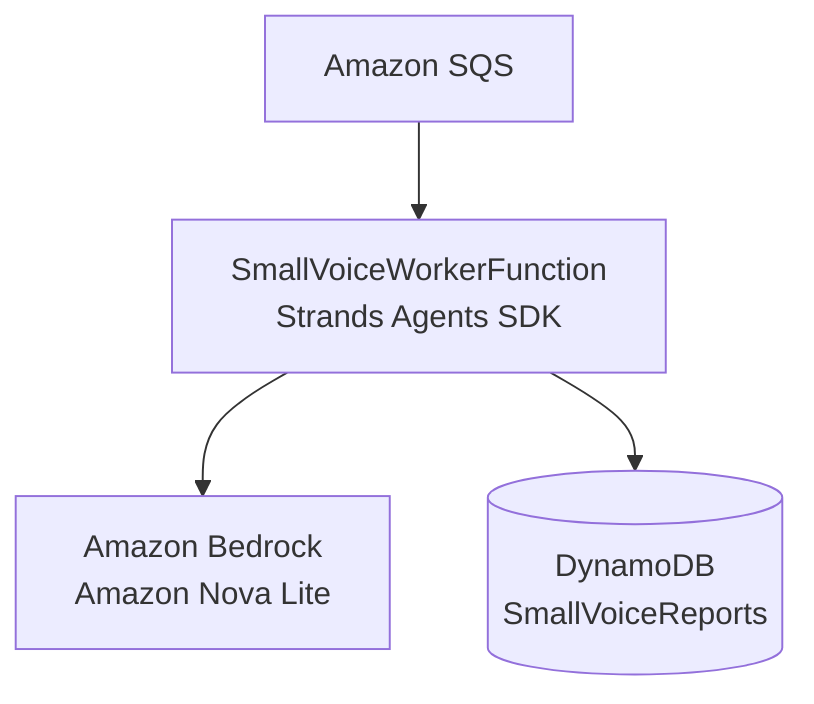

# Architecture update for Strands

Replace only the Worker-to-model section in the existing architecture diagram.

In the full diagram, label the path as:

`Amazon SQS → SmallVoiceWorkerFunction (Strands Agents SDK) → Amazon Bedrock / Amazon Nova Lite → Amazon DynamoDB`

Do not change the other nodes or the public URL:

`AWS Amplify → API Gateway → SmallVoiceSubmitFunction → DynamoDB → SQS → Worker → Bedrock → DynamoDB → SmallVoiceStatusFunction → Web UI`

Add this caption below the diagram:

> The asynchronous AWS architecture is unchanged. The minimal update replaces the worker's direct Bedrock invocation with a Strands Agent backed by `BedrockModel` and Amazon Nova Lite. The Agent stores a reviewable proposal; a human makes the final decision.
